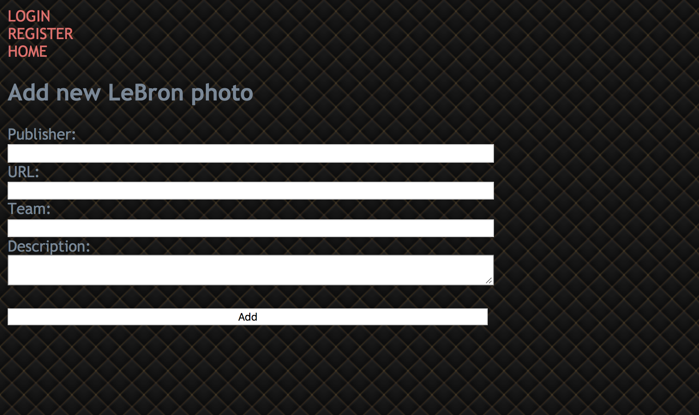
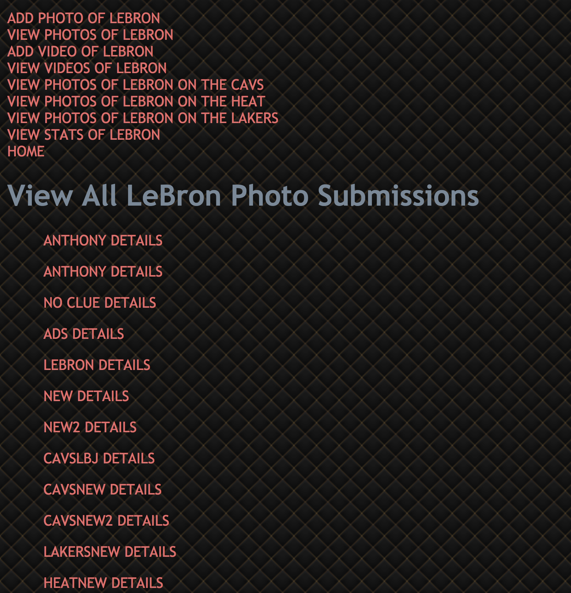
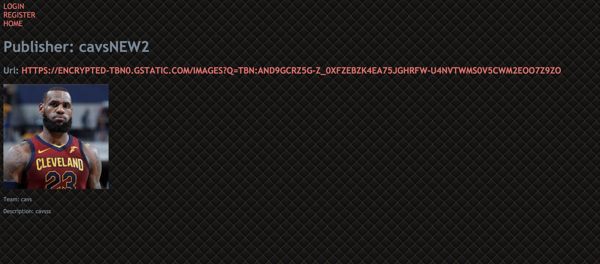
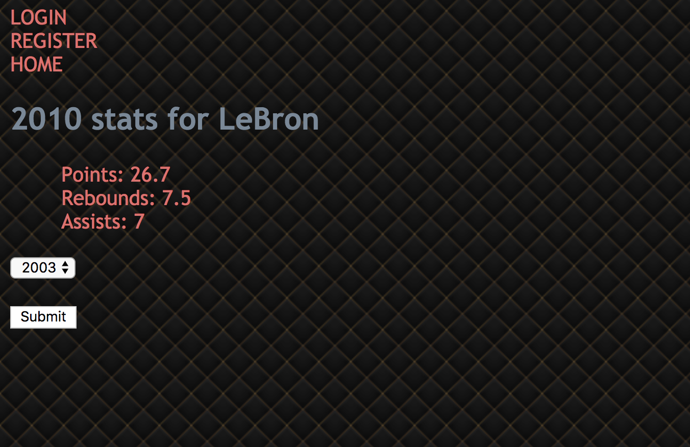

# LeBron James Tracker

## Overview

For the average NBA fan it is hard to remember what LeBron is up too.

LeBron James Tracker is a web app that will allow users to keep track of LeBron. Users can select the year and view LeBron's stats. User's can also see photos and videos of LeBron. Users should be able to login and register.


## Data Model

The application will store Users, Photos and Videos

* Stats are supplied (via NBA API)
* Each Photo and video has description links to allow more information (by embedding)


An Example User:

```javascript
{
username: "anthonycheng",
email: "ac5751@nyu.edu",
password: "kept secret",
hash: // a password hash,
}
```

An Example List with Embedded Items:

```javascript
{
user: // a reference to a User object
name: "LeBron James",
ppg: 28,
reb: 8,
ast: 7
}
```


## [Link to Commented First Draft Schema](db.js) 


## Wireframes

/photo/add - add photo of LeBron 



/photo/view - page for showing all photos



/photos/specificPage - page for showing specific photo and details of lebron



/stats - page for showing stats of LeBron



## Site map


## User Stories or Use Cases

1. as non-registered user, I can register a new account with the site
2. as a user, I can log in to the site
3. as a user, I can add a photo
4. as a user, I can view LeBron's stats
5. as a user, I can add a video
6. as a user, I can view LeBron photos of a specific team

## Research Topics

* (3 points) Unit Testing
* I will use Mocha to unit test functions
* (5 points) Use the NBA JavaScript API to gather statistics
* see <code>https://github.com/bttmly/nba</code>


8 points total out of 8 required points 


## [Link to Initial Main Project File](app.js) 

## Annotations / References Used

1. [Unit Testing](https://www.youtube.com/watch?v=MLTRHc5dk6s)
2. [NBA API](https://github.com/bttmly/nba) 

