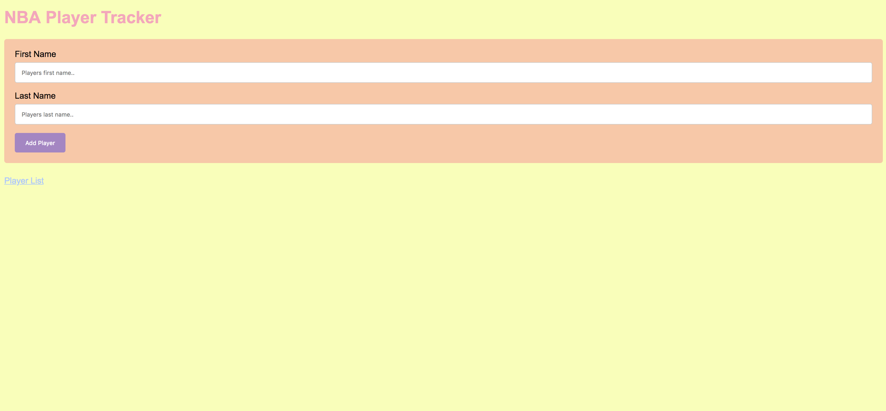
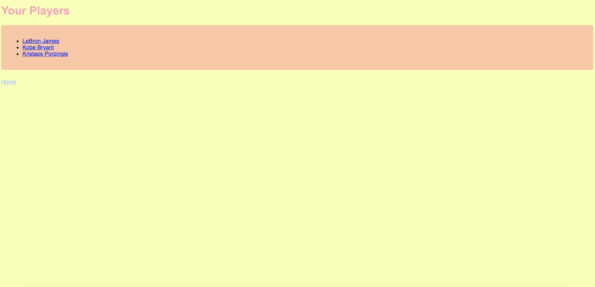
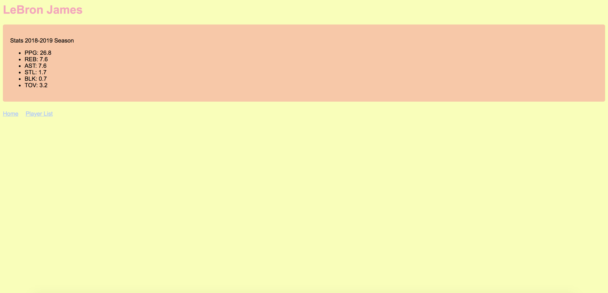

# NBA Player Tracker

## Overview

For the average NBA fan it is hard to remember what their favorite players statistics are.

NBA Stat Leaders is a web app that will allow users to keep track of their favorite players. Users can type the name of their player and track them. Users should be able to login and have access to all their favorite players statistics. 


## Data Model

The application will store Users, Players and PlayerLists

* users can have multiple Players(via references)
* each Player can have multiple stats (by embedding)


An Example User:

```javascript
{
username: "anthonycheng",
hash: // a password hash,
players: // an array of references to Player documents
}
```

An Example List with Embedded Items:

```javascript
{
user: // a reference to a User object
name: "LeBron James",
ppg: 28,
reb: 8,
ast: 7,
to: 2,
createdAt: // timestamp
}
```


## [Link to Commented First Draft Schema](db.js) 


## Wireframes

/players/create - homepage



/players - page for showing all players



/players/lebron - page for showing specific stats on your selected player



## Site map


## User Stories or Use Cases

(___TODO__: write out how your application will be used through [user stories](http://en.wikipedia.org/wiki/User_story#Format) and / or [use cases](https://www.mongodb.com/download-center?jmp=docs&_ga=1.47552679.1838903181.1489282706#previous)_)

1. as non-registered user, I can register a new account with the site
2. as a user, I can log in to the site
3. as a user, I can create a new grocery list
4. as a user, I can view all of the grocery lists I've created in a single list
5. as a user, I can add items to an existing grocery list
6. as a user, I can cross off items in an existing grocery list

## Research Topics

(___TODO__: the research topics that you're planning on working on along with their point values... and the total points of research topics listed_)

* (5 points) Integrate user authentication
* I'm going to be using passport for user authentication
* And account has been made for testing; I'll email you the password
* see <code>cs.nyu.edu/~jversoza/ait-final/register</code> for register page
* see <code>cs.nyu.edu/~jversoza/ait-final/login</code> for login page
* (4 points) Perform client side form validation using a JavaScript library
* see <code>cs.nyu.edu/~jversoza/ait-final/my-form</code>
* if you put in a number that's greater than 5, an error message will appear in the dom
* (5 points) vue.js
* used vue.js as the frontend framework; it's a challenging library to learn, so I've assigned it 5 points

10 points total out of 8 required points (___TODO__: addtional points will __not__ count for extra credit_)


## [Link to Initial Main Project File](app.js) 

(___TODO__: create a skeleton Express application with a package.json, app.js, views folder, etc. ... and link to your initial app.js_)

## Annotations / References Used

(___TODO__: list any tutorials/references/etc. that you've based your code off of_)

1. [passport.js authentication docs](http://passportjs.org/docs) - (add link to source code that was based on this)
2. [tutorial on vue.js](https://vuejs.org/v2/guide/) - (add link to source code that was based on this)

