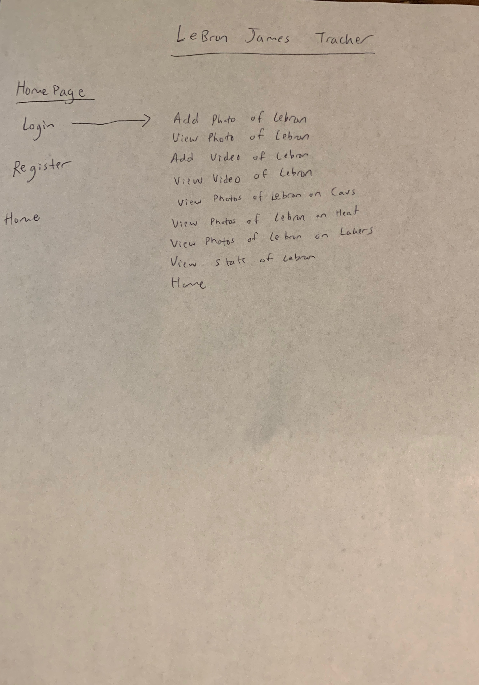

# NBA Player Tracker

## Overview

For the average NBA fan it is hard to remember what their favorite players statistics are.

NBA Stat Leaders is a web app that will allow users to keep track of their favorite players. Users can type the name of their player and track them. Users should be able to login and have access to all their favorite players statistics. 


## Data Model

The application will store Users, Players and PlayerLists

* users can have multiple Players(via references)
* each Player can have multiple stats (by embedding)


An Example User:

```javascript
{
username: "anthonycheng",
hash: // a password hash,
players: // an array of references to Player documents
}
```

An Example List with Embedded Items:

```javascript
{
user: // a reference to a User object
name: "LeBron James",
ppg: 28,
reb: 8,
ast: 7,
to: 2,
createdAt: // timestamp
}
```


## [Link to Commented First Draft Schema](db.js) 


## Wireframes

/players/create - homepage


/players - page for showing all players


/players/lebron - page for showing specific stats on your selected player


## Site map



## User Stories or Use Cases

1. as non-registered user, I can register a new account with the site
2. as a user, I can log in to the site
3. as a user, I can create a player list
4. as a user, I can view my player list
5. as a user, I can add players to my player list
6. as a user, I can delete players of my list

## Research Topics

* (5 points) Integrate user authentication
* I will use LoopBack via CLI to create an authentication
* LoopBack is a highly extensible open source Node.js framework
* (3 points) Use the NBA JavaScript API to gather statistics
* see <code>https://github.com/bttmly/nba</code>


8 points total out of 8 required points 


## [Link to Initial Main Project File](app.js) 

(___TODO__: create a skeleton Express application with a package.json, app.js, views folder, etc. ... and link to your initial app.js_)

## Annotations / References Used

(___TODO__: list any tutorials/references/etc. that you've based your code off of_)

1. [passport.js authentication docs](http://passportjs.org/docs) - (add link to source code that was based on this)
2. [tutorial on vue.js](https://vuejs.org/v2/guide/) - (add link to source code that was based on this)

